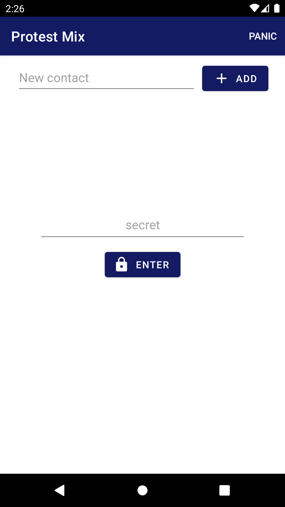
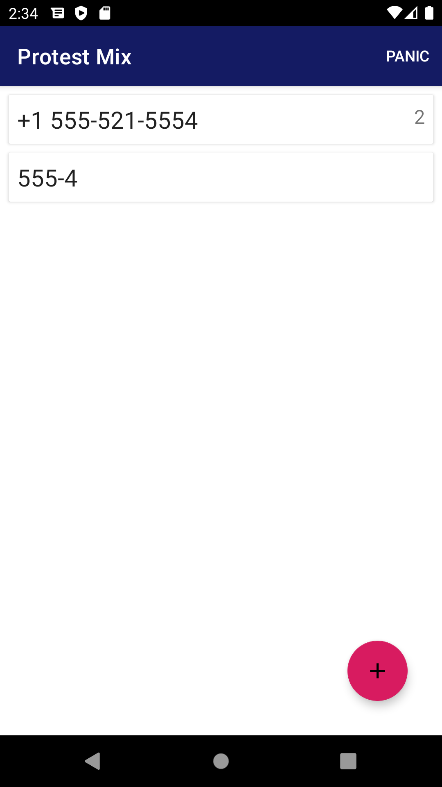
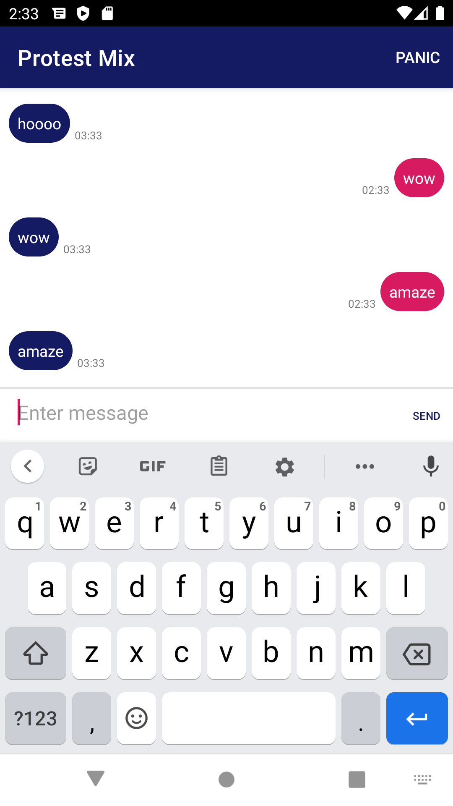

# Protest Mix for Android

To be eventually used as a way to bypass sms snooping.

## App Navigation

### Authentication Screen

Here the user can add contacts (which, at the moment, adds them not only as contacts the user can chat with but also prepopulates a list of phone numbers the user's app will forward messages to, if indicated in the sms received). Authentication is not checking for anything at the moment.

### Conversation Selector Screen

Here the user can create new conversations or enter new ones. Each conversation has a (slightly buggy) indicator of number of unread messages.

### Conversation Screen

Here the user can send and receive messages with the given contact. The app sends an sms to the provided phone number with a special indicator that that app should check it's local records and forward the message as appropriate. When app receives sms message with indicator, it does not load it onto this conversation screen and simply forwards the message instead.

Note **Panic** button which deletes all data in the app and goes to authentication screen. Accessible anywhere in the app.

## Next Steps, Ideas, and Thoughts

### Authentication
- How will users sign on? (My guess is local authentication with encrypted local db of user keys). Maybe there could be some sort of setup to create a new demonstration where you load everyone else's contact info into your phone and are assigned ids for that! Then local encrypted storage.

### Shuffling Protocol
- Will shuffling be based on convenience (whoever is closest) or deterministic/preplanned?
- Will shuffling be at specific intervals or whenever the opportunity arises (someone is close)?
- How many people should be shuffling at any given point?
- What if a person can't swap phones at the moment?
- How will we tell the app shuffling occured? Do we need other information during authentication besides new individual's key?
- Do we need protocol for returning phones at end? (I don't think so since I can't see how people will be )

### Message Forwarding Protocol
- How will nodes know who to send messages to? Who will keep track of what information?
- How will the receiver know who sent the original message?
- Possible that your phone is the one you want to chat with. Special consideration to avoid sending sms to self?

### Encryption + Other failsaifs + ideas
- Clearing tables through abort button (?) and on app close/quit/startup (maybe we don't want to do this?)
- Encrypting all databases
- Maybe encrypting sms itself? Don't know if this is possible
- Auto destructive databases -> if you don't sign in all data will be deleted next time you open the app? Might be overkill if db is already encrypted
- Fake/backup key that deletes everything too?
- Keys as QR codes (faster to authenticate after swapping phones, don't have to remember, easy to get rid of/destroy)

---

## In Progress and Completed

### Message Forwarding
- [x] Uses internal storage to determine who to forward message to. (Might change later when shuffling/forwarding protocols are developed)
- [x] Message forwarding based on indicator.
- [x] Creates conversation when new message is received who is not contact.

### UI
- [x] Remove drop shadow around send button
- [x] Sort contact cards by most recently received message (currently sorts by number of unread messages)
- [x] Display number of unread messages
- [x] Message bubbles (sent + receive).
- [x] Way of displaying contacts.
- [x] Way of starting conversations.
- [x] Way of accessing past conversations.
- [x] **ISSUE** Send button is blank

### Storage
- [x] Message timestamps are off - removed milisecond multiplication by 1000
- [x] Find better system for storing forward phone number (maybe local file storage)
- [x] Delete all stored data button (panic button?)
- [x] Finish integration of forwarding table to actually be queried when messages are received.
- [x] More reliable way of storing contacts in messages table (maybe UUID?)
- [x] **ISUE** Phone number formatting is not working properly
- [x] Standardize phone number String formatting
- [x] Message table
- [x] Forwarding table
- [x] Contacts table

